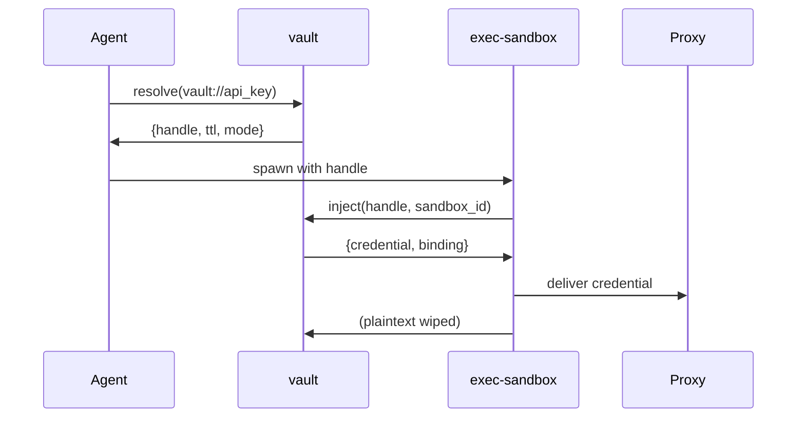

# vault

[](LICENSE)
[](Cargo.toml)
[](https://github.com/tkdtaylor/vault/commits)

**A JIT zero-knowledge secret store where credentials resolve to single-use handles the agent never
sees in plaintext.** The agent core holds only an opaque handle; the plaintext is injected at the
host boundary into [exec-sandbox](https://github.com/tkdtaylor/exec-sandbox) at execution time,
then wiped. It composes with
[policy-engine](https://github.com/tkdtaylor/policy-engine) (which sets the raise-only injection
floor), `exec-sandbox` (the injection edge), and [audit-trail](https://github.com/tkdtaylor/audit-trail)
(which tracks handle lifecycle). Part of the [Secure Agent Ecosystem](https://github.com/tkdtaylor/agent-builder#the-building-blocks),
Apache-2.0 licensed.

> **Status.** Core resolve/inject with single-use capability handles, first-use sandbox binding,
> encrypted-at-rest store (AES-256-GCM), optional persistent storage, and an opt-in loopback HTTP
> read surface (Vault KV-v2 compatible) are wired and tested. Admin verbs (put/get/list/rotate)
> with rotation-based handle invalidation are complete. Cloud secret-manager backend seam is
> planned.

## Contents

- [Quick start](#quick-start)
- [How it works](#how-it-works)
- [Guarantees](#guarantees)
- [Develop locally](#develop-locally)
- [Tech stack](#tech-stack)
- [Sponsorship](#sponsorship)
- [Enterprise support](#enterprise-support)
- [License](#license)

## Quick start

The fastest way to see it work — no daemon, no socket, no prerequisites:

```bash
git clone https://github.com/tkdtaylor/vault && cd vault
cargo run -- demo
```

Output:
```
resolve -> {"handle":"51e64a97d5f26a239533cd408b12e4643473f3631d8c91458a1fa6dd453ba1e7","injection_mode":"proxy","ttl":300}
inject  -> {"binding":{"env_var":"API_KEY","header":"Authorization","host":"api.example.com","scheme":"Bearer"},"credential":"SK-DEMO-DO-NOT-LEAK","delivery":"proxy","ok":true}
replay  -> {"error":{"code":"handle_consumed","message":"handle already used (replay rejected)","retryable":false}}  (rejected: single-use handle, D5)
```

This in-process demo shows: a secret resolved to a single-use handle, the plaintext injected only
at the edge, and a replayed handle rejected.

To run as a daemon (for agent integration):

```bash
cargo build --release
./target/release/vault serve --socket /run/vault.sock
```

## How it works

The agent requests a secret by reference (`vault://scope/key`). vault returns an opaque,
**single-use handle** — never the plaintext — with a TTL and a delivery mode (proxy or env).
The plaintext is held nowhere outside vault's memory; at execution time, `exec-sandbox`
presents the handle and its own sandbox identity. vault validates the binding, delivers the
credential to the injection edge (the egress proxy or env-setter), and invalidates the handle.
A replayed handle, or a handle bound to a different sandbox, is rejected.

**The plaintext lives only inside vault and at the injection edge.** The agent core never
sees it in logs, in memory, in context, or in the audit trail.



## Guarantees

| Guarantee | What it means | Enforced by |
|-----------|--------------|-------------|
| **Zero-knowledge resolve** | `resolve` returns `{handle, ttl, mode}` — never the plaintext. | `src/vault.rs::resolve` — test `resolve_hides_value_and_inject_delivers_proxy` |
| **Single-use handles** | A handle consumed on first `inject` is bound to that sandbox. Replay → `handle_consumed`; different sandbox → `handle_bound_to_other_sandbox`. | `src/vault.rs::inject` — test `replay_is_rejected` |
| **Raise-only injection floor** | `inject` effective mode is `max(policy_floor, requested)`. Vault raises (env→proxy), never lowers. | `src/vault.rs::inject` — test `floor_cannot_be_lowered` |
| **Fail-closed** | Unknown handle, unknown secret, malformed request, or RNG failure → structured error; no credential delivered. | Error paths in `src/vault.rs` / `src/main.rs` |
| **Memory-safe secret path** | Rust — no buffer overruns, use-after-free, or uninitialized reads on the crown-jewel secret path. | Language guarantee |
| **Encrypted at rest** | Each stored value is AES-256-GCM ciphertext with a unique 96-bit nonce; plaintext never written or logged. | `src/crypto.rs` — tests `tc001_put_stores_ciphertext_not_plaintext`, `tc005_tampered_ciphertext_fails_closed` |
| **Uid-restricted socket** | The vault→exec-sandbox handoff travels a `0600` Unix socket with kernel-verified `SO_PEERCRED` peer-uid check. | `src/main.rs` — ADR-002 |

## Interfaces

**IPC** — newline-delimited JSON over a Unix socket (`vault serve --socket /run/vault.sock`):
```json
{"op":"resolve","secret_ref":"vault://test/api_key","requester_identity":"sandbox-1"}
{"op":"inject","handle":"…","sandbox_identity":{"sandbox_id":"…"},"mode":"proxy"}
{"op":"put","secret_ref":"vault://test/api_key","value":"secret","injection_floor":"proxy"}
{"op":"get","secret_ref":"vault://test/api_key"}
{"op":"list"}
{"op":"rotate","secret_ref":"vault://test/api_key","value":"new_secret"}
{"op":"ping"}
```

**HTTP read surface** (opt-in, loopback-only; `vault serve --socket /run/vault.sock --http-addr 127.0.0.1:8200`):
- `GET /v1/sys/health` — health check
- `GET /v1/secret/data/:path` — equivalent to `resolve`, returns handle (Vault KV-v2 compatible shape)

**Backend seam** — pluggable key provider. Default: in-memory store with optional persistent
encrypted storage (`--store-path`). Cloud secret-manager backends (AWS/GCP/Azure, OpenBao,
HashiCorp Vault, PKCS#11 HSM) pluggable behind the `vault://` adapter scheme.

## Develop locally

```bash
cargo test              # run 74 tests
cargo build             # compile
cargo run -- demo       # in-process demo
cargo run -- serve --socket /tmp/vault.sock  # daemon (needs socket path)
```

The test suite covers resolve/inject round-trips, handle consumption, sandbox binding, rotation,
persistent storage, ciphertext integrity, TTL expiry, encryption nonces, memory zeroization, and
fail-closed behavior. See [docs/spec/fitness-functions.md](docs/spec/fitness-functions.md) for
the proposed fitness invariants.

Contributing runs through a test-spec-first, one-task-one-branch workflow. Read
[AGENTS.md](AGENTS.md) (the canonical, harness-neutral briefing) and
[CONTRIBUTING.md](CONTRIBUTING.md) before starting; tasks and their specs live under
[docs/tasks/](docs/tasks/).

## Tech stack

Rust 2021 — IPC server over a Unix socket, AES-256-GCM for encryption, and zero-knowledge
credential broking. See [docs/architecture/tech-stack.md](docs/architecture/tech-stack.md).

## Sponsorship

vault is independent, open-source security tooling. If it saves you time or risk, [sponsoring its development](https://github.com/sponsors/tkdtaylor) is the most direct way to keep it maintained.

## Enterprise support

Commercial support, integration help, and SLAs are available. Apache-2.0 means you can build on vault freely; paid support is a partner if you want one, never a requirement. Contact [tools@taylorguard.me](mailto:tools@taylorguard.me).

## License

[Apache License 2.0](LICENSE) — consistent with the Secure Agent Ecosystem. See [NOTICE](NOTICE)
for attribution and disclaimers, and [CONTRIBUTING.md](CONTRIBUTING.md) for the
inbound=outbound / DCO contribution terms.
