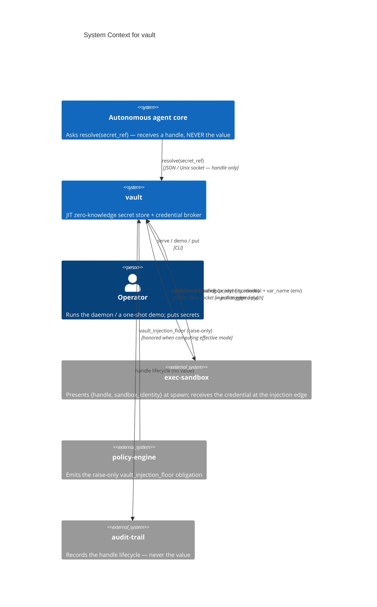
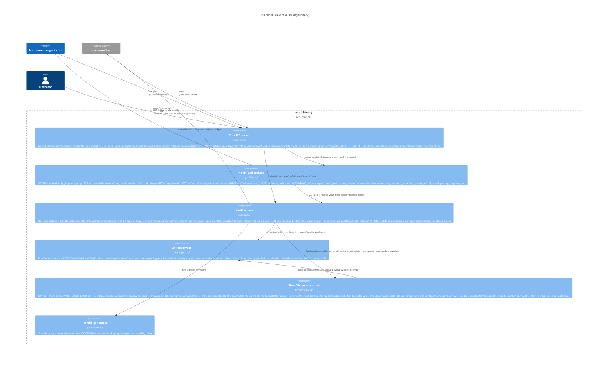
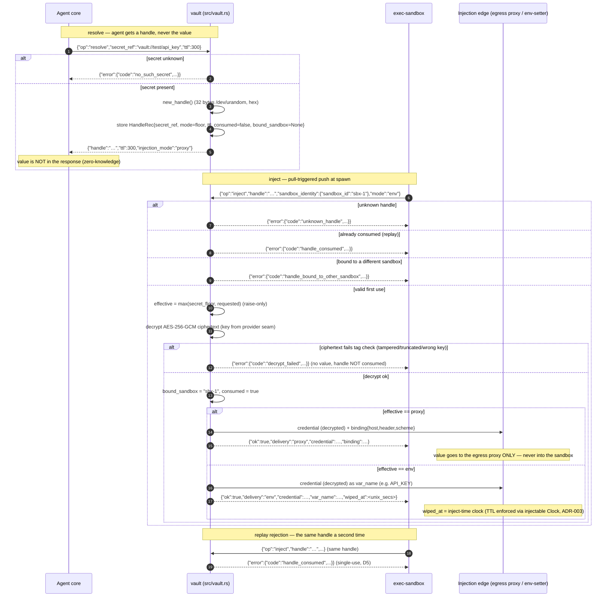

# Architecture Diagrams — vault

**Last updated:** 2026-06-21 (task 007 — opt-in persistent encrypted-on-disk store via the StoreFile layer, ADR-008)

C4-structured Mermaid diagrams plus the primary runtime sequence. See [overview.md](overview.md)
for prose context, [decisions/](decisions/) for the ADRs referenced here, and
[`../spec/architecture.md`](../spec/architecture.md) for the structured element catalog these
diagrams render.

These diagrams are part of the **authoritative spec**. Code changes that contradict a diagram
either invalidate the change or the diagram; one must be updated to match the other in the same commit.

> vault is a single deployable binary with three external integration classes: the agent core
> (resolve), exec-sandbox (inject, the injection edge), and policy-engine (raise-only floor it
> honors). Container and Component collapse into one diagram.

---

## 1. System Context — who uses it and what it touches

Note: the **value** crosses only the vault↔exec-sandbox injection edge. The agent core receives a
handle and nothing more. policy-engine influences vault indirectly via the raise-only floor it
emits; vault honors it as `max(secret_floor, requested)`.

---

## 2. Containers & Components — inside the binary

> One deployable unit (the static Rust binary). The load-bearing components a contributor touches first:

> **Two inbound listeners, asymmetric by design (ADR-006).** The Unix socket is `SO_PEERCRED`-gated
> and carries the full verb set (including value delivery at `inject`). The HTTP read surface is
> **opt-in** (`--http-addr`), **loopback-only**, **read-only**, and **unauthenticated** — it maps a
> Vault KV-v2 read onto value-free `resolve` and returns the **handle**, never the value, and routes
> nothing to `inject`/`put`/`rotate`/`get`/`list`. The value still crosses **only** the
> uid-restricted Unix socket at the injection edge.

**Key contracts**
- `resolve(secret_ref, ttl) -> { handle, ttl, injection_mode }` returns the secret's floor as
  `injection_mode` and **never the value** (`src/vault.rs::resolve`, ADR-001 §1).
- `inject(handle, sandbox_id, requested) -> { credential, … }` is the only path the value crosses,
  and only to the injection edge. Effective mode is `max(secret_floor, requested)` — **raise-only**
  (ADR-001 §5). Single-use + first-use sandbox binding (ADR-001 §6).
- The `vault://<scope>/<key>` scheme is the **backend adapter seam** (ADR-001 §4); inside the binary
  the **`StoreBackend` trait** (ADR-005) is the store-encryption seam — the default AES-256-GCM
  backend can be swapped for an OpenBao / cloud KMS / HSM backend without changing `resolve`/`inject`.
- The stored value is **AES-256-GCM ciphertext at rest** (ADR-005): `put`/`rotate` encrypt with a
  fresh 96-bit nonce, `inject` decrypts at the edge, and the master key comes from a key-provider
  seam — never beside the ciphertext. A tampered ciphertext fails `decrypt_failed` (no value).
- **Persistence is opt-in and orthogonal to the StoreBackend seam** (ADR-008): the `StoreFile` layer
  (`src/store_file.rs`) serializes the *already-encrypted* `EncryptedValue`s + non-secret metadata to
  a `0600` JSON file via the `StoredRecord` DTO — **ciphertext only, key off disk, handles never
  persist**. It loads on startup (no decrypt) and writes-through atomically on `put`/`rotate`; a
  corrupt file refuses to start, a failed write surfaces `store_persist_failed`. Unset `--store-path`
  ⇒ in-memory only, today's behavior unchanged.
- Every unmatched path is **fail-closed** — a structured error, no credential delivered (ADR-001 §8).

---

## 3. Primary runtime flow — resolve → inject → wipe (incl. replay rejection)

The `demo` subcommand exercises this exact flow in-process (put → resolve → inject →
replay-rejected) without binding a socket — operator verification of the single-use handle
invariant.

> The store is **encrypted at rest** (AES-256-GCM, ADR-005): `put`/`rotate` encrypt the value with a
> fresh 96-bit nonce before it enters the store, and the decrypt step above is the only place the
> cleartext re-materialises. The **TTL auto-wipe clock** is enforced (env-mode `wiped_at` is the real
> inject-time clock, ADR-003), and the **SO_PEERCRED** peer-uid check gates every accept before
> dispatch (`peer_uid == server_uid`; socket is `0600` *and* kernel-peer-uid-gated, ADR-002).

ADRs governing this flow: [ADR-001](decisions/001-foundational-stack.md) (zero-knowledge resolve,
raise-only floor, single-use + first-use binding, uid-restricted socket, fail-closed),
[ADR-002](decisions/002-socket-peercred-check.md) (kernel-verified SO_PEERCRED peer-uid gate),
[ADR-003](decisions/003-ttl-auto-wipe-clock.md) (TTL expiry / injectable clock),
[ADR-004](decisions/004-admin-verbs-rotation-invalidation.md) (admin verbs + rotate-invalidation),
and [ADR-005](decisions/005-encrypted-at-rest-store.md) (AES-256-GCM encrypted-at-rest, key off the
ciphertext). Future backend adoptions swap only the store behind the `vault://` / `StoreBackend`
seam — this sequence shape, the IPC framing, and the handle/binding semantics are preserved.

---

## Maintaining these diagrams

- **Trigger to update:** a new actor/container/component appears; a boundary moves; an external
  integration is added or removed; an ADR changes a diagrammed flow. Keep
  [`../spec/architecture.md`](../spec/architecture.md) in sync.
- **Edit existing over adding new.** Duplicates rot independently.
- **Note ADRs that don't change diagrams.** An ADR that swaps the store behind the `vault://` seam
  leaves the System Context and runtime-sequence shape unchanged.
- **Update the date at the top** when you change anything substantive.
