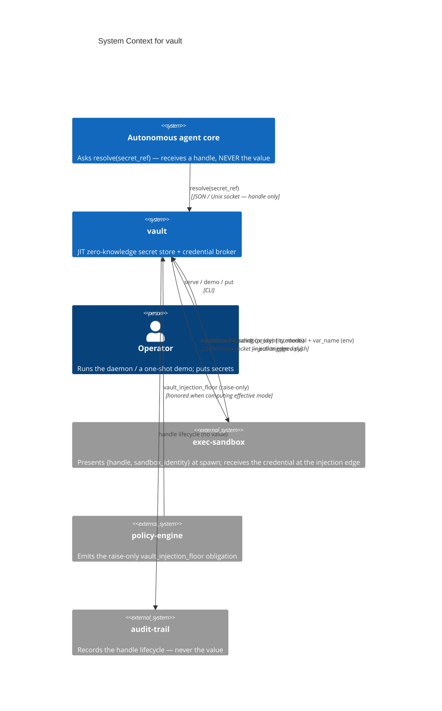
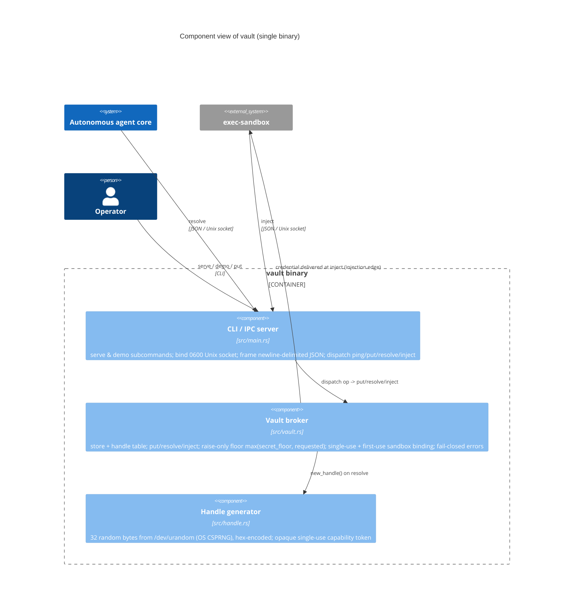

# Architecture Diagrams — vault

**Last updated:** 2026-06-18 (bootstrap — baseline diagrams for the v0 skeleton / v1 contract, ADR-001)

C4-structured Mermaid diagrams plus the primary runtime sequence. See [overview.md](overview.md)
for prose context, [decisions/](decisions/) for the ADRs referenced here, and
[`../spec/architecture.md`](../spec/architecture.md) for the structured element catalog these
diagrams render.

These diagrams are part of the **authoritative spec**. Code changes that contradict a diagram
either invalidate the change or the diagram; one must be updated to match the other in the same commit.

> vault is a single deployable binary with three external integration classes: the agent core
> (resolve), exec-sandbox (inject, the injection edge), and policy-engine (raise-only floor it
> honors). Container and Component collapse into one diagram.

---

## 1. System Context — who uses it and what it touches



Note: the **value** crosses only the vault↔exec-sandbox injection edge. The agent core receives a
handle and nothing more. policy-engine influences vault indirectly via the raise-only floor it
emits; vault honors it as `max(secret_floor, requested)`.

---

## 2. Containers & Components — inside the binary

> One deployable unit (the static Rust binary). The load-bearing components a contributor touches first:



**Key contracts**
- `resolve(secret_ref, ttl) -> { handle, ttl, injection_mode }` returns the secret's floor as
  `injection_mode` and **never the value** (`src/vault.rs::resolve`, ADR-001 §1).
- `inject(handle, sandbox_id, requested) -> { credential, … }` is the only path the value crosses,
  and only to the injection edge. Effective mode is `max(secret_floor, requested)` — **raise-only**
  (ADR-001 §5). Single-use + first-use sandbox binding (ADR-001 §6).
- The `vault://<scope>/<key>` scheme is the **backend adapter seam** (ADR-001 §4): the in-memory
  store can be swapped for an encrypted local store / OpenBao / cloud KMS / HSM behind the same
  contract, without changing callers.
- Every unmatched path is **fail-closed** — a structured error, no credential delivered (ADR-001 §8).

---

## 3. Primary runtime flow — resolve → inject → wipe (incl. replay rejection)

```mermaid
sequenceDiagram
    autonumber
    participant Agent as Agent core
    participant Vault as vault (src/vault.rs)
    participant Sandbox as exec-sandbox
    participant Edge as Injection edge (egress proxy / env-setter)

    Note over Agent,Vault: resolve — agent gets a handle, never the value
    Agent->>Vault: {"op":"resolve","secret_ref":"vault://test/api_key","ttl":300}
    alt secret unknown
        Vault-->>Agent: {"error":{"code":"no_such_secret",...}}
    else secret present
        Vault->>Vault: new_handle() (32 bytes /dev/urandom, hex)
        Vault->>Vault: store HandleRec{secret_ref, mode=floor, ttl, consumed=false, bound_sandbox=None}
        Vault-->>Agent: {"handle":"…","ttl":300,"injection_mode":"proxy"}
        Note over Agent: value is NOT in the response (zero-knowledge)
    end

    Note over Sandbox,Vault: inject — pull-triggered push at spawn
    Sandbox->>Vault: {"op":"inject","handle":"…","sandbox_identity":{"sandbox_id":"sbx-1"},"mode":"env"}
    alt unknown handle
        Vault-->>Sandbox: {"error":{"code":"unknown_handle",...}}
    else already consumed (replay)
        Vault-->>Sandbox: {"error":{"code":"handle_consumed",...}}
    else bound to a different sandbox
        Vault-->>Sandbox: {"error":{"code":"handle_bound_to_other_sandbox",...}}
    else valid first use
        Vault->>Vault: effective = max(secret_floor, requested)  (raise-only)
        Vault->>Vault: bound_sandbox = "sbx-1"; consumed = true
        alt effective == proxy
            Vault->>Edge: credential + binding{host,header,scheme}
            Vault-->>Sandbox: {"ok":true,"delivery":"proxy","credential":…,"binding":…}
            Note over Edge: value goes to the egress proxy ONLY — never into the sandbox
        else effective == env
            Vault->>Edge: credential as var_name (e.g. API_KEY)
            Vault-->>Sandbox: {"ok":true,"delivery":"env","credential":…,"var_name":…,"wiped_at":0}
            Note over Edge: env-mode auto-wipe (wiped_at) is a placeholder — TTL clock is not yet enforced
        end
    end

    Note over Sandbox,Vault: replay rejection — the same handle a second time
    Sandbox->>Vault: {"op":"inject","handle":"…",...}  (same handle)
    Vault-->>Sandbox: {"error":{"code":"handle_consumed",...}}  (single-use, D5)
```

The `demo` subcommand exercises this exact flow in-process (put → resolve → inject →
replay-rejected) without binding a socket — operator verification of the single-use handle
invariant.

> TODO (diagrammed honestly): the **wipe** step is partial — env-mode `wiped_at` is a placeholder
> `0` and there is no TTL auto-wipe clock yet (`src/vault.rs`, ADR-001 §6 note). The
> **SO_PEERCRED** peer-uid check on the socket is also not yet present (socket is `0600` only).

ADRs governing this flow: [ADR-001](decisions/001-foundational-stack.md) (zero-knowledge resolve,
raise-only floor, single-use + first-use binding, uid-restricted socket, fail-closed). Future
evaluator/backend adoptions swap only the store behind the `vault://` seam — this sequence shape,
the IPC framing, and the handle/binding semantics are preserved.

---

## Maintaining these diagrams

- **Trigger to update:** a new actor/container/component appears; a boundary moves; an external
  integration is added or removed; an ADR changes a diagrammed flow. Keep
  [`../spec/architecture.md`](../spec/architecture.md) in sync.
- **Edit existing over adding new.** Duplicates rot independently.
- **Note ADRs that don't change diagrams.** An ADR that swaps the store behind the `vault://` seam
  leaves the System Context and runtime-sequence shape unchanged.
- **Update the date at the top** when you change anything substantive.
